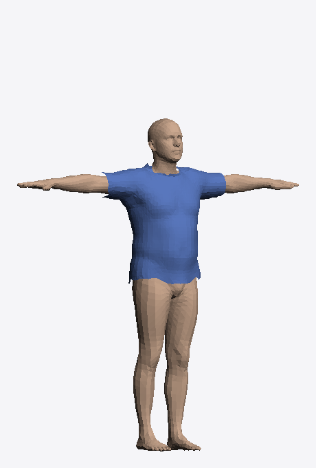
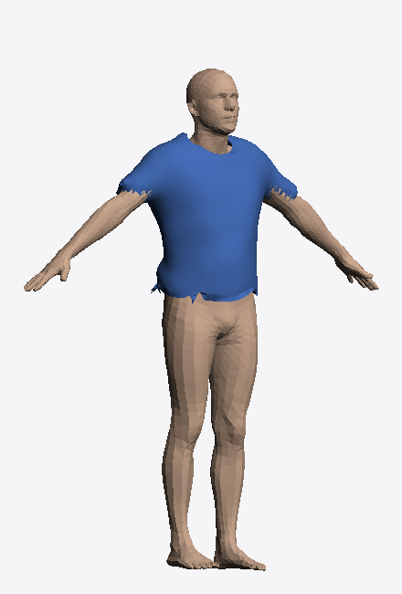
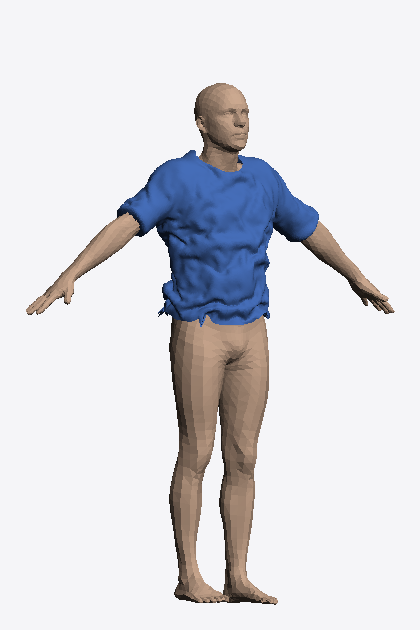
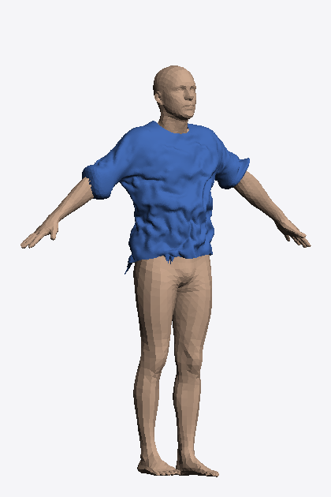
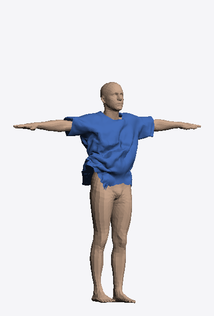
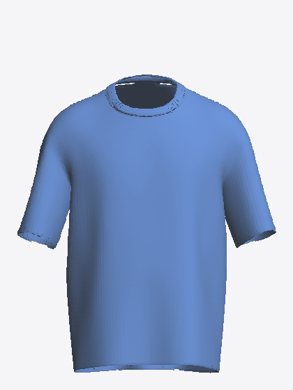

# The Journey: From Painted Skin to a Validated Physics Drape

The other two documents in this folder —
[`garment-fitting-pipeline.md`](garment-fitting-pipeline.md) and
[`physics-drape-pipeline.md`](physics-drape-pipeline.md) — describe how the
finished system works. This document is different: it's the story of *how we
got there* — the approaches that were tried and abandoned, the bugs that
looked fixed but weren't, the moments a "dramatic improvement" turned out on
closer inspection to still be bad, and the discipline that eventually
separated real fixes from wishful ones.

The short version: almost nothing here worked on the first attempt. What
actually got this pipeline to a good result was refusing to accept an
improvement on looks alone, and instead **isolating one variable at a time**
until the true cause of a problem was pinned down with a measurement, not a
guess.

---

## Part 1 — Where we started: painted skin, not clothing

The original dressed-avatar feature didn't use a garment mesh at all. It
classified the body's own vertices (via SMPL's linear-blend-skinning weights),
pushed the "torso" vertices outward a little, and painted them the garment's
colour. This is a reasonable quick trick, but it has a hard ceiling: the
garment has no shape of its own. Sleeves are exactly as wide as the arm inside
them; a boxy cut and a fitted cut look identical; there's no hem, no collar
opening, no independent silhouette. It reads as a "rigid shield," not
clothing.

That ceiling is what motivated everything that follows.

## Part 2 — Pipeline 1: building a real garment mesh, and everything that broke along the way

The plan was straightforward in concept: bind a genuinely separate garment
mesh to the body surface (nearest-triangle + barycentric coordinates + a
signed normal offset), deform it as the body changes, and add size-aware
expansion. The plan was simple. The execution surfaced one bug after another.

### The wrong-gender-body bug

The first working version used a garment template scanned from a real person
(the MGN — Multi-Garment Net — dataset). The donor's own body shape is baked
into that scan. The first template used was scanned from a female subject.
Result: **every avatar, including male bodies, rendered wearing a shirt with a
visible female chest shape.** This was flagged immediately and was treated as
a core, non-negotiable problem, not a cosmetic one.

The fix required auditioning multiple donor scans (comparing several MGN
subject IDs against reference renders) to find male-presenting and
female-presenting donors, then keying the template choice explicitly off the
requested gender (`TEMPLATE_OBJ = {"male": "tshirt_male.obj", "female":
"tshirt_crew_base.obj"}`). This sounds obvious in hindsight; finding a donor
scan that actually read as "male chest, not a female chest with a slightly
different color" took several rounds of visual comparison, not one.

### The fix that made things worse

Immediately after the gender fix, a new problem appeared: **visible cuts and
tears in the garment mesh — worse than before the fix.** The seam where the
sleeve mesh met the torso mesh had come apart into disconnected islands during
the gender-swap. The cause was a mesh-welding gap: the donor scan's sleeve and
torso pieces were never actually joined into one connected surface, so any
downstream operation that assumed a single connected mesh (smoothing,
normal-based offsetting) tore it open at the seam. The fix was a proper
radius-based union-find weld (`_weld_and_clean_mesh`) that merges
close-enough seam vertices into one connected surface before anything else
touches the mesh.

### The neckline gap

Next: a visible gap at the collar. The Laplacian smoothing pass pulls every
vertex toward the average of its neighbours — but a boundary vertex (like the
neckline loop) only *has* neighbours on one side, since there's no fabric past
the edge. Left unpinned, repeated smoothing passes shrink and warp that loop
asymmetrically, which reads as a gap or tear at the collar. The fix: record
the boundary loop's positions before smoothing, and pin them back afterward
(`smooth_garment`'s boundary-pin behaviour, still in the code today).

### The texture that wouldn't go away

Once product-photo texturing was added, a **black artifact appeared on the
sleeve** where the flat garment photo didn't fully cover the mesh's UV
unwrap. This was fixed once — and then **reappeared** on the next round,
because the first fix addressed one specific case (a particular crop) and not
the general one (any photo where the garment doesn't fill the frame). The
durable fix was a proper garment-region detector plus background inpainting
(`_detect_garment_mask`, `_inpaint_background`, `prepare_texture_image`) that
extends genuine fabric colour into any gap, instead of leaving a code-colored
void.

### The bug that wasn't a bug

At one point the female-chest-on-male-body problem appeared to have come
back. It hadn't — the fix was correct, but the running server hadn't been
restarted, so it was serving stale code. This is worth recording precisely
because it looked identical to a real regression and could easily have
triggered another unnecessary fix-hunt.

Pipeline 1 shipped once all of the above settled: gender-correct templates,
welded seams, pinned boundaries, robust texturing, and size differentiation
via chest-circumference-driven expansion (`apply_size_looseness`).

---

## Part 3 — Pipeline 2: teaching the garment to actually drape

Pipeline 1's fit was still purely **kinematic** — the garment re-projected
onto the body at a fixed offset, following it exactly. Real cloth doesn't do
that: it hangs, gathers, and bridges under gravity. Compare the kinematic fit
to a real bake:

| Kinematic fit (Pipeline 1, no physics) |
|:---:|
|  |
| Shrink-wrapped to the body — no independent drape, no folds, no sag |

The plan for Pipeline 2 was decided early and never really changed: run a
real cloth simulation offline, once, across a grid of body shapes; store only
the *difference* between the simulated result and a cheap kinematic fit; blend
that difference at runtime. What changed constantly, over many rounds, was
**getting the baked simulation to actually look like clean cotton instead of
a crumpled bag.**

### The first physics results: "a wet, crumpled plastic bag"

The first working bakes were stable — no blow-ups, no NaNs — and were
rejected immediately on sight:

Dense, chaotic, tightly-packed wrinkles across the whole torso. This was
described at the time as looking like "a wet, crumpled plastic bag," and that
description was accurate, not an exaggeration to brush off. It was explicitly
**not accepted** as a starting point to iterate from.

### The tempting shortcut that didn't work: heavy smoothing

The obvious next move was to smooth the crumpling away after the fact:

This was reported, at the time, as a "dramatic improvement." It was not. On
closer inspection this was correctly called out: smoothing hides the
crumpling without addressing why it happened, degrades the fabric's genuine
structure, and does nothing for the hem, which was still short and ragged.
**This moment mattered more than the technical fix that followed it** — it's
the point where "does it look better" stopped being an acceptable bar, and
"can you prove what's actually causing it" became the requirement for every
change after.

### Learning to isolate one variable at a time

From here on, the working method changed: change exactly one thing, hold
everything else fixed, and compare the *raw*, unprocessed physics — never
judge a fix through a smoothing pass that could be hiding the real result.

**Isolation test 1 — is the boundary (hem/neckline) causing the crumpling?**
A boundary-loop resample was applied to one bake and compared, raw, against
the original:

| Original boundary | Resampled boundary |
|:---:|:---:|
|  |  |

The edges got cleaner — and the crumpling across the body was **identical**.
This was a useful negative result: it definitively ruled out the boundary as
the cause, which meant no more time would be spent chasing hem/neckline fixes
as a solution to the crumpling, and attention moved further upstream (the
physics parameters and the mesh itself).

**Early parameter tuning — stiffness.** A separate test compared soft vs.
stiff cloth parameters directly:

Pushing stiffness up to try to force broader folds instead produced solver
buckling — an accordion effect, worse than the soft case, not better. This
ruled out "just make it stiffer" as the fix, and pointed at something more
structural than a parameter tweak.

### The detour: chasing a better-looking external asset

At this point, a genuine question was raised: was the *template mesh itself*
the problem, not the physics? A free, CC-BY-licensed, low-poly t-shirt asset
was found with a much cleaner, boxier, more modern silhouette than the
in-house SMPL-derived template:

This looked like a shortcut worth taking. It wasn't, and figuring out why took
real diagnostic work rather than an early abandonment:

- The mesh's wireframe was inspected directly and turned out to be **generic,
  uniform triangulation** — not the deliberate vertical edge loops a hand-authored
  garment would have. Its only actual asset was its *silhouette*, not its
  topology.
- It had 22 non-manifold edges and inconsistent face winding. QuadriFlow
  (the tool used to get a clean, sim-friendly quad mesh) **refused outright**
  at every target resolution tried. A proper manifold repair (merge, recalc
  normals, explicitly remove the exact faces creating non-manifold edges) got
  non-manifold edges down to zero — and QuadriFlow **still refused.**
- At full resolution (15k+ vertices), the cloth solver **deadlocked** with
  self-collision enabled. An isolation test (self-collision off vs. on, same
  mesh, nothing else changed) proved this specific mesh's failure was a
  self-collision cost/geometry problem, not a general simulation bug —
  a finding that turned out to generalize to the final template too.

The conclusion, reached deliberately rather than by just giving up: this
mesh's only value was its *shape*, and that shape could be reproduced on the
already-clean, already-sim-friendly SMPL-derived template via the boxify
step, without inheriting any of its topology problems. The external asset was
dropped. The isolation-testing habit it forced, however, is what unlocked
everything that came after.

### The real breakthrough: self-collision was the crumpling, not a missing fix for it

Conventional intuition says self-collision (the cloth colliding with itself)
should be *on* for realism. A dedicated isolation test — holding resolution,
pose, and every other parameter fixed — proved the opposite for this garment:
self-collision **was the cause of the crumpling**, not a safeguard against it.
The excess fabric was fighting itself into tight accordion ridges; without
that self-fighting, the same fabric drapes into broad, calm folds under
gravity and body collision alone.

This result was not accepted on looks either. It was checked with a
layer-stack raster (to rule out that "off" was secretly letting fabric pass
through itself instead of draping) and a non-adjacent-vertex proximity check,
on the *worst-case* body (a slim body in the largest size — maximum excess
fabric). Both held. Full detail and the before/after renders are in
[`physics-drape-pipeline.md` §3.1](physics-drape-pipeline.md#31-self-collision-off--the-decisive-finding).

This one finding fixed the look *and* cut bake time 3.8× (~180s → ~49s per
bake) — which is what made the eventual 125-point grid affordable at all.

### Resolution — the other counterintuitive result

A resolution bracket (holding the new self-collision-off recipe fixed) tested
whether a finer mesh would look better. It didn't — **higher resolution
produced more crumpling**, because a finer mesh has more freedom to buckle
into tight folds. The coarsest resolution tested won on both quality and cost.
This overturned an earlier assumption (that the original template was "too
blocky, needs more resolution") that had never actually been tested in
isolation until this point.

### Design drift caught mid-flight

Two mistakes were caught not by testing, but by review of the work itself,
after the recipe seemed otherwise settled:

- A pilot script's trilinear-interpolation code had a copy-paste weight bug.
  Two validation holdout points happened to sit at exactly the one coordinate
  (0.5) where the buggy formula and the correct formula produce identical
  numbers — so the existing "clean" validation result didn't actually prove
  the fix worked. New holdouts were added specifically off that coordinate to
  close the gap.
- Separately, the pilot's grid-generation script had quietly drifted from
  the original, explicitly locked design: garment **size** was supposed to be
  a discrete catalog choice (S/M/L/XL/XXL — never blended, since nobody orders
  a half-size), but the pilot code had implemented full continuous
  interpolation across size as well as body shape. This wasn't caught by any
  test — it was caught by asking "did we actually decide this, or did the
  code just end up this way?" The design was restored to discrete-size
  before the full 125-bake grid was run, which would otherwise have baked a
  wrong assumption into every single grid point.

### The hem bug that survived every previous round

After the full 125-point grid was baked and passed its own validation, a
final visual review of the result gallery caught something that had actually
been present since much earlier and simply never got fixed: **every single
corner of the grid had a visibly wavy, scalloped hem**, not just the
loose/excess cases. Tracing it back: the region-extraction step cuts the
garment from the body template at a flat height threshold, which leaves a
zigzag edge — and the smoothing pass *by design* pins the boundary loop in
place (that's what stopped the earlier neckline-gap bug), so it structurally
cannot fix a bad boundary shape. A boundary resample had been discussed
much earlier in the project (the isolation test that ruled out the boundary
as the *crumpling* cause) but a proper fix had never actually been written
into the production template pipeline.

The fix — periodically smoothing each open boundary loop, then
redistributing its vertices evenly by arc length so the topology and
vertex-correspondence never change — is now `resample_boundary()` in
`garment.py`, applied to the locked template. It was verified two ways: a
direct visual overlay of the hem line before and after, and a check that the
clean line survives an actual physics bake rather than being distorted by
it. See [`physics-drape-pipeline.md` §3.5](physics-drape-pipeline.md#35-hem-resample)
for the before/after image.

### Final validation, done skeptically rather than declared

Even after the full grid baked successfully with zero failures, the result
was not taken as proven correct by default. Specific checks were run to try
to *break* the conclusion rather than confirm it:

- **Does interpolation actually work, or does it just look plausible?**
  Held-out body shapes — deliberately placed off the grid, at fractional
  coordinates that hadn't been used before — were baked for real and compared
  against what pure interpolation (never simulated) predicted. Error was
  small (well under 1cm) and the actual-vs-predicted renders were visually
  indistinguishable, including at the largest, hardest excess-fabric slab.
- **Is the one large-error outlier a real problem?** A per-vertex error
  heatmap on the worst holdout showed the large error was a single, tightly
  clustered fold-tip — not a systematic failure spread across the garment.
- **Does a denser grid actually help, or would it just cost more for no
  reason?** This was tested directly rather than assumed: doubling the local
  grid density measurably cut both the average and the worst-case error at
  the loosest, hardest slab — confirming the final grid's density was
  earning its cost, not just guessed at.
- **Is the vertex correspondence between the template, all 125 bakes, and the
  delta library actually intact?** Checked explicitly, not assumed: every
  grid input's face array was confirmed byte-identical to the template, and
  a stored delta was re-derived from scratch and compared to the library —
  exact match to the last bit.

Full numbers for all of the above are in
[`physics-drape-pipeline.md` §6](physics-drape-pipeline.md#6-validation).

---

## Part 4 — Where this leaves things

Pipeline 1 and Pipeline 2 are both shipped for male avatars, end to end,
runtime-integrated, with no simulation ever running on a live request. Two
things were deliberately **not** solved, and are recorded as open follow-up
rather than silently skipped:

- **Female.** A sanity bake using the exact locked male recipe drapes cleanly
  on the torso, but bunches visibly at the sleeve cuffs — the sleeve opening
  was shaped against male shoulder/arm proportions. This needs its own
  tuning pass and its own 125-point grid; it doesn't block or share risk with
  the male pipeline, which is why it wasn't done as part of this work.
- **Sleeve refinement.** Across both genders, the sleeve is the template's
  weakest region visually (a little stiff/tube-like). It's the clearest
  remaining "this is CG" tell and the natural next polish item.

## What actually made the difference

If there's one lesson worth carrying forward, it's this: nearly every real
fix in this project came from **refusing to accept a visual impression** —
"looks better," "seems fixed," "dramatic improvement" — **without a test that
could have proven it wrong.** The boundary-resample isolation test, the
self-collision worst-case-body-plus-two-independent-metrics check, the
densification test, and the byte-exact correspondence check all share the
same shape: change one thing, measure it, and only then believe it. The
crumpled-bag renders and the QuadriFlow dead end are left in this document on
purpose — they were the expensive part, and the discipline they forced is
most of why Pipeline 2 works.
