# Pipeline 2: Physics-Baked Garment Drape

This document explains the physics-drape system built on top of the garment-mesh
engine described in [`garment-fitting-pipeline.md`](garment-fitting-pipeline.md)
(Pipeline 1). It covers why a second pipeline was needed, the core idea that
makes real cloth physics affordable at runtime, every design decision and the
isolation test that justified it, the full validation, and how the result is
wired into the live endpoint.

The short version: **we run a real Blender cloth simulation offline, once, at
every point of a body-shape grid, store only the cheap-to-apply difference
between the simulated drape and a plain kinematic fit, and blend those
differences at runtime in milliseconds.** No simulation ever runs on a user
request.

---

## 1. Why a second pipeline

Pipeline 1 replaced the old "painted skin" garment with a genuinely separate
garment mesh bound to the body. That fixed the garment's *shape* — sleeves,
hems, and cut became independent of the body. But the fit was still purely
**kinematic**: the garment was re-projected onto the body surface at a fixed
offset. It followed the body faithfully, which is exactly the problem — real
cloth does not shrink-wrap the body. It hangs, gathers, and folds under gravity;
it bridges across the chest and drapes off the shoulders; a loose tee pools
differently on a slim frame than a large one.

Getting that behaviour *correctly* means solving cloth physics. But a full cloth
simulation takes tens of seconds per body — unacceptable inside a request. The
entire pipeline exists to resolve that tension.

## 2. The core idea: bake offline, blend cheap

Two observations make it work:

1. **The expensive part is the same shape family every time.** For one garment,
   the way it drapes changes *smoothly* as the body changes. A drape on a
   175 cm/100 cm-chest body is very close to the drape on a 176 cm body.
2. **The drape is a small correction on top of the cheap fit.** The kinematic
   fit is already in the right neighbourhood; physics mostly adds folds, sag,
   and bridging — a *delta* of about 10–15 mm on average.

So the pipeline:

1. Picks a **grid** over the body-shape parameters that actually drive drape.
2. Runs the **real cloth simulation once at every grid point** (offline).
3. Stores, per grid point, only the **delta** = `physics_result − kinematic_fit`.
   Every mesh shares the template's vertex ordering, so deltas are directly
   comparable and interpolable.
4. At runtime: do the cheap kinematic fit, **bilinearly interpolate** the delta
   from the surrounding grid points, and add it. Milliseconds, no solver.

Everything below is about making each of those steps *correct and cheap*.

## 3. How the recipe was chosen: one variable at a time

Cloth simulation has many knobs, and early attempts produced a badly crumpled
result — folds so dense and chaotic the shirt read as "a wet, crumpled plastic
bag" rather than clean cotton. Rather than tune many parameters at once, each
factor was **isolated**: change exactly one variable, hold everything else
fixed, and compare the *raw* physics side by side. This section documents those
tests, because the conclusions are unintuitive.

### 3.1 Self-collision OFF — the decisive finding

The single highest-impact decision. Conventional intuition says self-collision
(the fabric colliding with itself) adds realism and should be *on*. For this
garment it was the **cause** of the crumpling.

With self-collision on, the excess torso fabric fights itself and buckles into
tight accordion ridges. With it off, the same fabric drapes smoothly over the
body — body collision alone keeps it from sinking in, and gravity plus bending
produce broad, clean folds.

| Self-collision **ON** | Self-collision **OFF** |
|:---:|:---:|
| 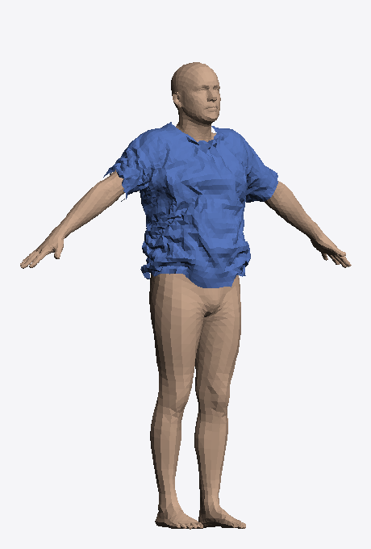 | 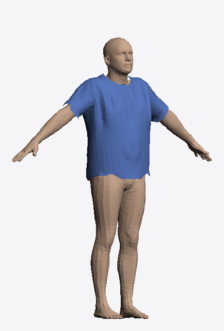 |
| Accordion corrugation across the torso | Broad, smooth, structured folds |

This was not taken on looks alone. Two guards were added to rule out the
possibility that "off" was merely *hiding* excess fabric by letting it pass
through itself:

- A **layer-stack raster** counts how many fabric layers lie along each view
  ray. Self-collision **off** produced *fewer* stacked layers, not more — i.e.
  it is not hiding overlap; self-collision **on** was *creating* it.
- A **non-adjacent proximity check** (any two topologically-distant vertices
  closer than 5 mm) found essentially **zero** silent self-intersection with
  self-collision off, on the worst-case body.

| Layers, self-collision **ON** | Layers, self-collision **OFF** |
|:---:|:---:|
| 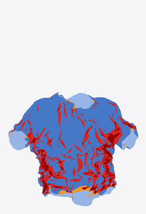 | 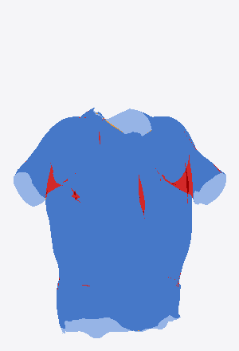 |
| Red = 4+ overlapping layers (bunching) | Clean 1–2 layers (genuine drape) |

The finding was stress-tested specifically on the **loosest** body/size
combination (a slim body wearing the largest size — maximum excess fabric,
where self-collision would matter most if it mattered anywhere). Self-collision
*on* there failed to even converge and the fabric rode up 11 cm; *off* settled
cleanly and draped as a real loose tee.

As a bonus, disabling self-collision cut each bake from ~180 s to ~49 s — a
3.8× speed-up that is what makes a 125-point grid affordable.

### 3.2 Mesh resolution — coarser is better here

A resolution bracket (≈3,700 / 5,900 / 8,500 vertices) with everything else
fixed showed the opposite of the intuitive result: **higher resolution made the
crumpling worse.** A finer mesh has more freedom to buckle into tight folds; the
coarser cage is forced into broader, calmer folds. Combined with the fact that
self-collision cost scales super-linearly with vertex count, the lowest
resolution (~3,730 verts, "q4000") won on both quality *and* cost.

### 3.3 Boxify 0.65 — the cut

The torso cross-section is blended toward a soft superellipse ("boxified") to
give the modern, slightly-structured cut of the reference garment rather than a
body-hugging one. A sweep of the boxify strength (0.45 / 0.65 / 0.85) at the
chosen resolution picked **0.65** as the balance: boxy and modern without
looking stiff.

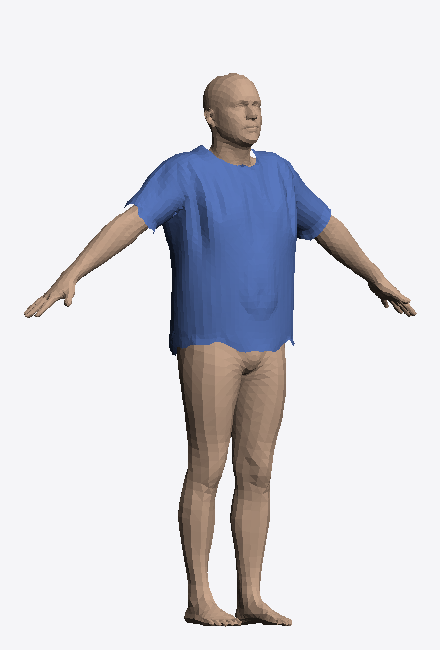

### 3.4 Relaxed pose (whole avatar)

The garment is authored and baked with the body in a slightly **relaxed pose**
(shoulders lowered ~37° from A-pose). A-pose jams fabric into the armpit before
physics even starts; the relaxed pose gives the sleeves and armholes room to
drape. Because the baked drape is defined against a relaxed-pose body, **the
whole avatar renders in the relaxed pose for this garment category** — body and
drape must share the same pose or the sleeves and hem sit wrong. (A-pose remains
the system default everywhere else.)

### 3.5 Hem resample

The garment region is cut from the body template at a flat height threshold,
which leaves a jagged, zig-zag hem. The Laplacian smoothing pass deliberately
*pins* the boundary (so it does not distort the neckline), so it cannot fix the
hem. A dedicated **boundary resample** — periodically smooth each open loop,
redistribute its vertices evenly by arc length (vertex count unchanged, so
correspondence is preserved), then relax the interior — cleans it into a smooth
line. This is applied to the locked template and survives the physics bake.

| Hem **before** resample | Hem **after** resample |
|:---:|:---:|
| 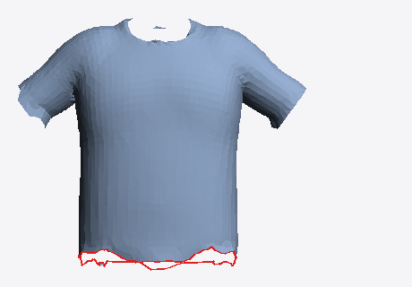 | 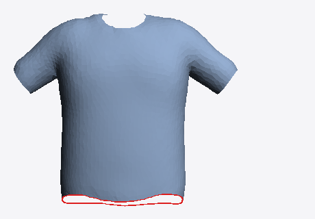 |

The resample is implemented as `resample_boundary()` in
[`backend/garment.py`](../backend/garment.py).

## 4. The locked recipe

| Parameter | Value | Basis |
|---|---|---|
| Mesh resolution | ~3,730 verts (q4000, QuadriFlow) | best quality *and* cost (§3.2) |
| Self-collision | **OFF** | removes crumpling; 3.8× faster (§3.1) |
| Pose | whole avatar → relaxed (tee category only) | armpit/sleeve room (§3.4) |
| Boxify strength | 0.65 | modern cut, not stiff (§3.3) |
| Hem | boundary-resampled | clean edge (§3.5) |
| Cloth model | heavy structured cotton | broad folds |

## 5. The grid and the delta library

Two body-shape axes plus the catalog size drive the drape:

- **Build** (chest/mass), 5 levels
- **Height**, 5 levels
- **Size** — a **discrete** catalog choice (S/M/L/XL/XXL), *not* interpolated.
  Customers pick a real size; there is no "half-size", so the library is one
  independent build×height slab per size.

That is a **5 × 5 × 5 = 125-point grid**. Each point is baked with the locked
recipe (self-collision off, ~49 s), and its delta is stored as `float16`.

- Library size: **2.7 MB total** (~22 KB per point)
- Mean drape delta across the grid: **11.6 mm** (range 9.5–17.1 mm)

The full run was 125/125 bakes with **zero failures**, ~2 hours, one-time.

## 6. Validation

### 6.1 Interpolation accuracy

The load-bearing question: does blending the delta from surrounding grid points
reproduce a real bake at a body *between* grid points? Held-out bodies at
off-grid fractional build/height were baked for real and compared to the
interpolated prediction (which was never simulated):

| Holdout | Size slab | Kinematic-only error | **Interpolated error** | Drape captured | Max error |
|---|---|---|---|---|---|
| f_M | M | 10.0 mm | **0.7 mm** | 93% | 9.3 mm |
| f_XL | XL | 12.5 mm | **2.6 mm** | 80% | 20.3 mm |
| f_XXL | XXL (largest excess) | 15.3 mm | **2.1 mm** | 86% | 27.0 mm |

Interpolation recovers the drape to ~1 mm in the tight/mid range and a few mm at
the loose extreme. The prediction (green, pure interpolation) is
silhouette-indistinguishable from the actual bake (blue):

| XXL — actual bake | XXL — interpolated (never baked) |
|:---:|:---:|
| 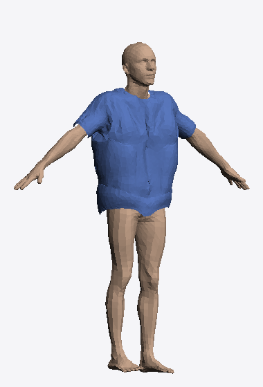 | 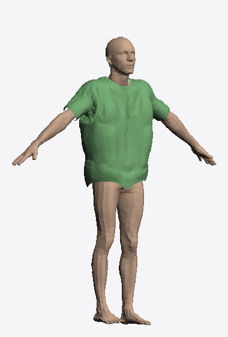 |

### 6.2 Where the residual error lives

A per-vertex error heatmap on the hardest (XXL) holdout shows the error is *not*
systematic: the structured upper body is near-perfect (deep blue), the loose
lower-torso fabric carries a few mm (green), and the worst spot is a single
clustered fold — 0.7% of vertices, all within an 8 mm patch. This is benign
fold nonlinearity, not a modelling failure.

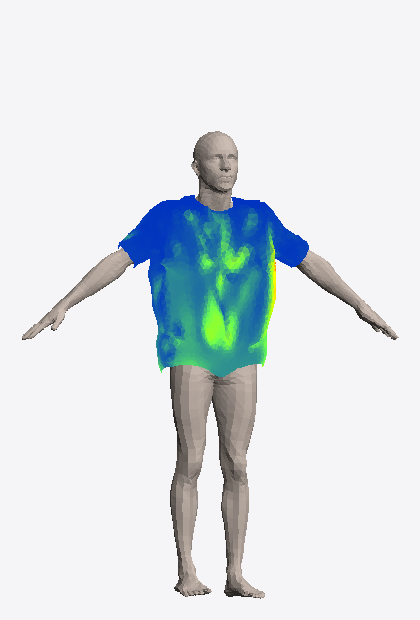

A separate densification test confirmed the interpretation: doubling grid density
around a loose holdout cut its mean error 2.9 → 1.8 mm and its max 26 → 14 mm —
the residual shrinks with sampling, which is why the grid is 5×5 rather than 3×3.

### 6.3 Self-intersection across the whole grid

Across all 125 baked points: **106/125 have exactly zero** non-adjacent
self-overlap (<5 mm); the worst case is 2 vertex-pairs out of 3,730; mean 0.20.
No systemic bunching anywhere.

### 6.4 Vertex-correspondence integrity

The entire approach depends on every mesh — template, all 125 bakes, the delta
library, and the runtime fit — sharing one vertex ordering. This was verified
explicitly: all 125 grid inputs have exactly 3,730 vertices with faces
byte-identical to the template; the delta library's faces match; and a
round-trip check (library delta vs. freshly recomputed `physics − kinematic`)
agreed to **0.0000 mm**.

### 6.5 Drape quality at the extremes

Real bakes at the grid corners — the baggiest, tightest, and typical cases — all
read as clean cotton with a clean hem:

| Max excess (XXL on a slim, tall body) | Typical (L, average build) |
|:---:|:---:|
|  | 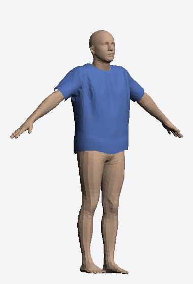 |

## 7. Runtime integration

At request time there is **no simulation**. The flow, implemented in
[`backend/physics_drape.py`](../backend/physics_drape.py) and wired into
`generate_dressed_avatar_mesh_v2` in [`backend/main.py`](../backend/main.py):

1. Solve the body shape (SMPL betas) from the user's measurements.
2. Pose the body in the **relaxed pose** (whole avatar).
3. Reproduce the **exact kinematic fit** the deltas were baked against (clean
   template → deform → size looseness → interpenetration resolve).
4. Map the body to grid coordinates: the chosen **size selects an exact slab**;
   build and height become fractional indices.
5. **Bilinearly interpolate** the delta within that slab and add it.
6. A light interpenetration pass cleans any interpolation-induced skin poke.
7. Assemble the 2-node (body + garment) GLB, textured with the product photo.

The delta library and clean template are loaded once into a process-wide
`PhysicsDraper` singleton. The path is **male-only for now** and **gated** by the
`MANIKAN_PHYSICS_DRAPE` env var; any failure (or a female request) falls back to
the Pipeline 1 kinematic fit, so avatar generation is never blocked.

Correctness was verified end-to-end: at an exact grid point the runtime
`drape()` reproduces the actual baked mesh to **0.00 mm** (interpolation is exact
there, so this confirms the kinematic reproduction is faithful). A real endpoint
call produces a valid draped GLB:

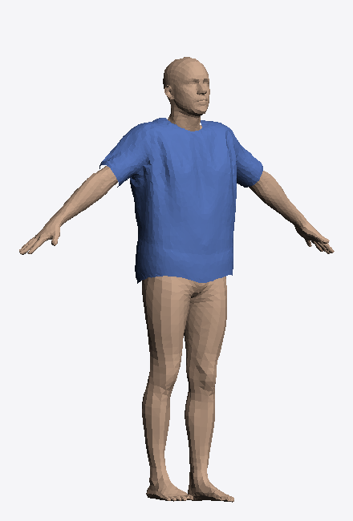

## 8. Performance

| Stage | Cost | When |
|---|---|---|
| One bake | ~49 s | offline |
| Full 125-point grid | ~2 hr | offline, once per garment |
| Delta library | 2.7 MB | stored in repo |
| **Runtime drape** | **milliseconds** (dominated by SMPL fit, ~1.4 s total) | per request |

The expensive cost is paid once, offline. Every user request is a cheap fit plus
an interpolation.

## 9. Known limitations and future work

- **Female pass.** The recipe was authored on the male body. A female sanity
  bake drapes cleanly on the torso but **bunches at the sleeve cuffs**, because
  the sleeve opening was shaped to male shoulder/arm proportions. Female needs
  its own tuning pass and its own 125-point grid (a separate delta library). It
  is scoped as independent follow-up work; the male pipeline does not depend on
  it, and female requests currently fall back to the Pipeline 1 fit.
- **Sleeve refinement.** The sleeve opening is the template's weakest region on
  both genders (a little stiff/wide). A sleeve-cut refinement would improve male
  *and* female and is the highest-visibility geometric polish item.
- **Deliberate softness.** Folds are broad and smooth by design (self-collision
  off). This matches the target "clean modern cotton" look; recovering more
  aggressive fold detail would mean paying the self-collision cost again.
- **QC renders are flat-shaded/untextured.** Final output runs subdivision +
  smooth normals + the product texture on top, and reads noticeably better than
  the geometry-only images in this document.

## 10. Files

**Production**
- [`backend/physics_drape.py`](../backend/physics_drape.py) — runtime draper
  (delta library load, grid-coordinate mapping, bilinear interpolation, drape).
- [`backend/main.py`](../backend/main.py) — `_dressed_glb_physics` +
  integration into `generate_dressed_avatar_mesh_v2`.
- [`backend/garment.py`](../backend/garment.py) — `resample_boundary()` hem fix.
- `backend/models/garments/tshirt_physics/` — clean template, relaxed reference
  body, delta library, grid manifest.

**Offline bake tooling** (`backend/tools/drape_bake/`)
- `bake_one.py` — the Blender cloth bake for a single point (self-collision
  overridable via `SELF_COLLISION=0`).
- `extract_relaxed_tee.py` — author the tee region in the relaxed pose + boxify.
- `phase4_grid.py` — generate the 125 grid bake inputs.
- `pilot_grid.py` / `pilot_qc.py` — the small validation rehearsal + QC.
- `gen_clean_xl.py` / `densify_qc.py` — densification test.
- `gen_holdouts.py` — off-grid interpolation holdouts.
- `render_*.py` — the QC/gallery renderers.

The Blender venv (`bpy_venv/`) and intermediate `.npz` bake caches are
git-ignored; only the scripts and the final production assets are tracked.
